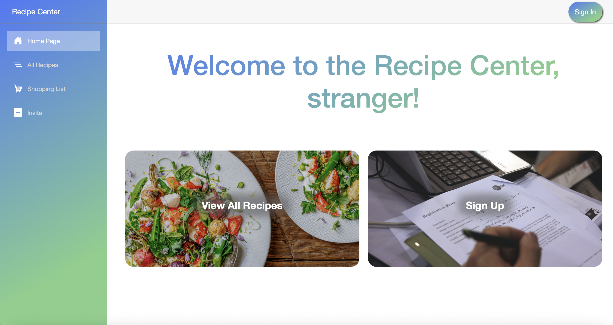
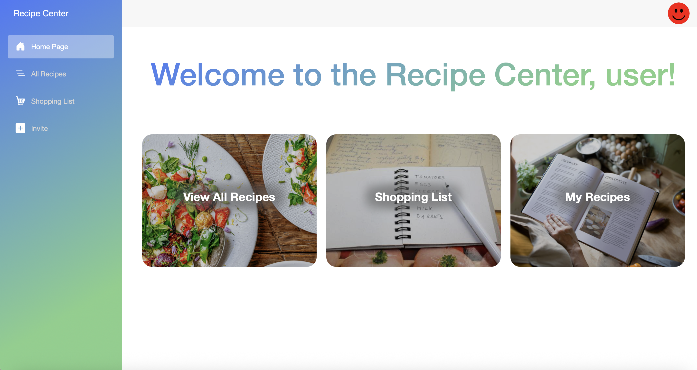
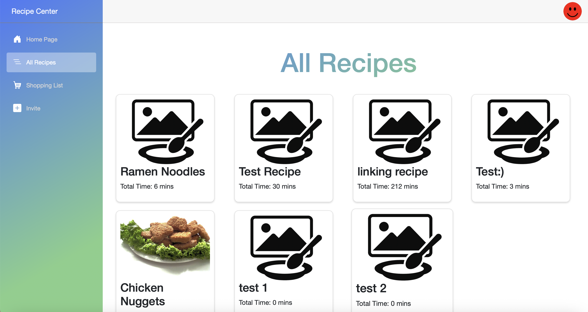
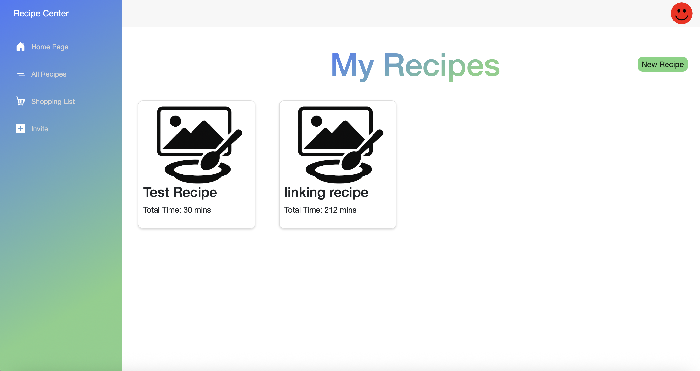
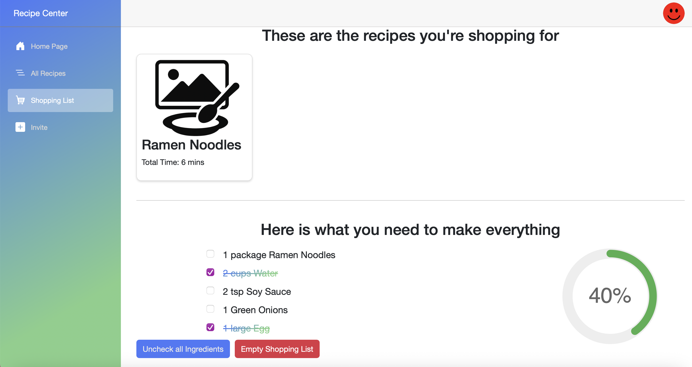
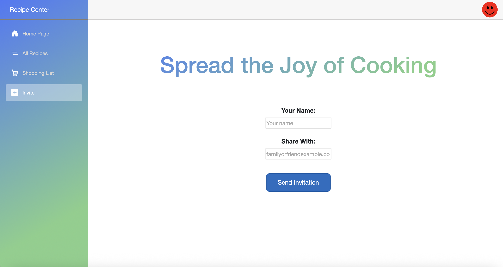
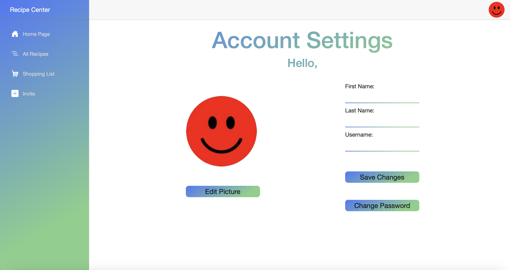

# Recipe Center
## Tech Stack 
- Frontend: .NET Blazor, HTML, CSS
- Backend: C#
- Database: SQLite
- Architecture: Full-stack web application

## Overview
Recipe Center is a full-stack web application designed to make sharing recipes with friends and family members simple and centralized. Instead of searching through text messages or notes, users can store, manage, and share recipes all in one place.

This application supports user profiles, recipe management, and dynamic shopping list creation, making it ideal for collaborative cooking and meal planning.

## Features
- Create, view, edit, and delete personal recipes
- Browse and view recipes created by other users
- User profile creation and editable profile information
- Generate shopping list based on selected recipes
- Edit and remove items from shopping lists
- Invite friends and family to join the recipe platform
- Persistent data storage using SQLite

## Getting Started
### Prerequisites
- .NET SDK installed
- SQLite

### Running the Application
1. Clone the repository
2. Open the project in Visual Studio Code or your preferred IDE
3. Restore dependencies
4. Run the application locally

Note: This project is not currently deployed. It will need to be run locally.

Data Privacy: The database included in this repository contains no real user data. All records have been removed. The screenshots are for demonstration purposes only.

## Screenshots
Home Page

Home Page when Not Signed In

All Recipes

My Recipes

Shopping List

Invite Page

Account Settings

## Contributors
Developed collaboratively by a team of four.
- Mark Wright
- Ryan Sinclair
- Zach Nelson
- Sarah Dombroski